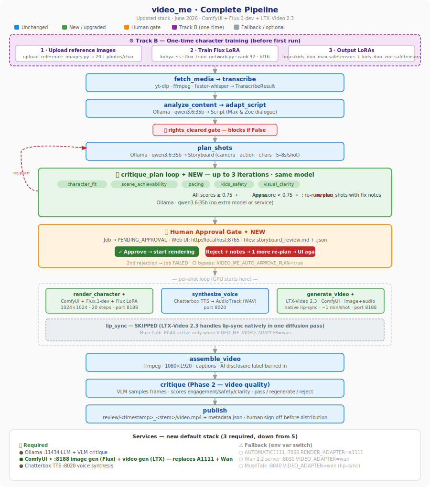

# video_me

Orchestration pipeline that turns a reference video URL into an original animated kids'
educational short starring the swappable `kids_duo` cast: Max and Zoe. Every model is an
interchangeable adapter behind a typed capability ABC.

## Status

**Phase 2 code-complete — 313 tests passing.**  
Stack upgraded to ComfyUI + Flux.1-dev (image) + LTX-Video 2.3 (video, native lip-sync).  
See `BUILD_PROGRESS.md` for the full implementation journal and next steps.

```
Phase 0  Skeleton + storage          ✅ COMPLETE
Phase 1  Full pipeline A1.0–A1.12   ✅ COMPLETE (code)
Phase 2  Critic loop A2.x            ✅ COMPLETE (code) — VLM service needed for real judgment
Track B  LoRAs + voice files         ⚠️ PARTIAL — SD1.5 LoRAs trained; Flux LoRAs need retraining
Track D  GPU services                ⚠️ ComfyUI + Fish Audio S2 + Ollama needed
```

## Quick start (tests only — no services needed)

```bash
git clone https://github.com/rekha0708/video_me
cd video_me
python -m venv .venv && source .venv/bin/activate
pip install -e ".[dev]"
python -m pytest -q      # 313 tests, all passing
```

## Running the Phase 0 no-op workflow

```bash
python -m scripts.run_noop_job
# Writes artifacts under .local/artifacts/ and records job in .local/video_me.db
```

With local PostgreSQL + MinIO:
```bash
docker compose up -d
VIDEO_ME_JOB_STORE=postgres VIDEO_ME_ARTIFACT_STORE=s3 python -m scripts.run_noop_job
```

## Running the Phase 1 pipeline (requires Track B + D)

```python
import asyncio
from core.config import load_app_config
from core.workflow import run_pipeline_job

config = load_app_config()
job = asyncio.run(run_pipeline_job(
    source_url="https://www.youtube.com/watch?v=EXAMPLE",
    rights_cleared=True,   # operator confirms source is cleared for transformation
    app_config=config,
))
print(job.status)   # "completed"
# Output: review/<timestamp>_<stem>/video.mp4 + metadata.json
```

## Running the Phase 2 pipeline (requires Track B + D + VLM)

```python
import asyncio
from core.config import load_app_config
from core.workflow import run_with_critique

config = load_app_config()
job = asyncio.run(run_with_critique(
    source_url="https://www.youtube.com/watch?v=EXAMPLE",
    rights_cleared=True,
    app_config=config,
))
print(job.status)
# Critiques are persisted as critique_attempt_1, critique_attempt_2, ...
# Sampled critique frames are recorded on CritiqueResult.sampled_frame_uris
```

Phase 2 uses an MVP-friendly visual critique strategy: sample frames from the assembled local
video with ffprobe/ffmpeg, embed those images in the OpenAI-compatible multimodal request, and
persist the sampled frame paths for audit/debug. Move this to a separate VLM wrapper service later
if frame extraction/model serving becomes GPU-bound, needs batching/caching, or multiple critique
backends need the same preprocessing.

## Track B — Files required before pipeline runs

```
loras/
  kids_duo_max.safetensors   ← Flux LoRA for Max
  kids_duo_zoe.safetensors   ← Flux LoRA for Zoe

voices/
  kids_duo/
    max.wav   (Max — ~10–30s clear reference speech)
    zoe.wav   (Zoe)
```

Run `python -m scripts.check_track_b` to verify placement.

### Training Flux LoRAs (one-time, per character)

```bash
# Step 1 — import raw reference photos into the training dataset
python -m scripts.upload_reference_images --character max ~/photos/max/*.jpg
python -m scripts.upload_reference_images --character zoe ~/photos/zoe/*.jpg
# Aim for 20+ images per character. Captions are written automatically.

# Step 2 — train (requires kohya_ss + Flux model weights in models/Flux/)
accelerate launch flux_train_network.py \
  --config_file assets/kids_duo/training/kohya_config.toml
# Change output_name to kids_duo_zoe for Zoe's run.
# Output: loras/kids_duo_max.safetensors (~37 MB, Flux format)
```

> **Note:** existing SD 1.5 LoRAs from the June 2026 training run will not work with Flux.
> Retrain using the steps above. The kohya config already targets `flux1-dev.safetensors`.

## GPU setup and readiness

Install runtime dependencies on a GPU machine:

```bash
bash scripts/setup_gpu.sh
```

Run strict readiness before renting or launching a real run:

```bash
python -m scripts.check_runtime_readiness
```

For local/mock code testing without starting model services:

```bash
bash scripts/setup_gpu.sh --dry-run
bash scripts/setup_gpu.sh --code-test --skip-services
```

The shell script creates/uses `.venv`, installs Python runtime extras, installs/checks
`ffmpeg`/`ffprobe`, keeps `yt-dlp` on PATH through the venv, and runs the readiness checker.
Lower-level helpers remain available as `python -m scripts.setup_gpu ...` and
`python -m scripts.check_runtime_readiness ...`.

### Training venv workaround

The current project `.venv` is fine for pipeline checks, but it has a Torch/CUDA
mismatch for local LoRA training on this GPU image. Use `/workspace/venv` for
sd-scripts training instead:

```bash
/workspace/venv/bin/python3 -m pip install -r /workspace/sd-scripts/requirements.txt
HF_HUB_ENABLE_HF_TRANSFER=0 /workspace/venv/bin/python3 /workspace/sd-scripts/train_network.py \
  --dataset_config assets/kids_duo/training/dataset_max.toml \
  --output_dir loras --output_name kids_duo_max
```

Use `.venv/bin/python` for normal project commands such as `scripts.check_track_b`
and `scripts.check_runtime_readiness`.

## Track D — Services required before pipeline runs

| Service | Port | Purpose | Required? |
|---|---|---|---|
| Ollama | 11434 | LLM (analyze, adapt, plan) + VLM critique | ✅ Always |
| ComfyUI | 8188 | Flux image gen + LTX-Video 2.3 video gen | ✅ Default |
| Fish Audio S2 | 8025 | Voice synthesis (EN + HI) | ✅ Default |
| Chatterbox TTS | 8020 | Voice synthesis (EN only, fallback) | ⚠️ Only if `TTS_ADAPTER=chatterbox` |
| AUTOMATIC1111 | 7860 | SD 1.5 image gen | ⚠️ Only if `RENDER_ADAPTER=a1111` |
| Wan 2.2 | 8030 | Image-to-video | ⚠️ Only if `VIDEO_ADAPTER=wan` |
| MuseTalk | 8040 | Lip sync | ⚠️ Only if `VIDEO_ADAPTER=wan` |

> **Default stack needs only 3 services: Ollama + ComfyUI + Fish Audio S2.**

See `.claude/agents/pipeline-runner.md` for startup commands and pre-flight check.

## Architecture

> **Interactive pipeline diagram:** open [`assets/pipeline_flow.html`](assets/pipeline_flow.html) in a browser for the full annotated flow with all stages, critique scores, approval gate, and service summary.



Every stage is a `Capability[Request, Result]` ABC in `core/capabilities/`.  
Concrete adapters live in `adapters/<stage>/`.  
The full DAG is in `core/workflow.py:run_pipeline_job()`.

### Language selection

Select the output language at run start. The pipeline adapts the script dialogue and voice synthesis accordingly.

```bash
# English only (default)
VIDEO_ME_TARGET_LANGUAGE=en

# Hindi only
VIDEO_ME_TARGET_LANGUAGE=hi

# Both English and Hindi — runs the pipeline twice, produces two review outputs
VIDEO_ME_TARGET_LANGUAGE=both
```

Or via the `target_language` parameter on `run_pipeline_job(target_language="hi")`.

Fish Audio S2 handles both languages from the same voice reference file — no separate Hindi voice recording needed.

### Image candidate selection (self-learning)

After the storyboard is approved, the pipeline generates **N candidate images per shot** (default 3) and runs them through a VLM critique (`qwen3.6:35b`, the same model used for all other stages) that scores each on character consistency, prompt adherence, kids-appropriateness, composition, and expressiveness. The winner is pre-selected automatically.

A second web UI at `http://localhost:8765` shows a **grid of all shots' winner images** — the operator can confirm or override any pick before video generation starts. Every override is written back to `assets/kids_duo/critique_feedback.jsonl` so the VLM learns your preferences over time (last 5 entries are injected as few-shot context on the next run).

```bash
VIDEO_ME_IMAGE_CANDIDATES=3              # images generated per shot
VIDEO_ME_IMAGE_CRITIQUE_MODEL=qwen3.6:35b   # same model as all other LLM stages
VIDEO_ME_AUTO_APPROVE_IMAGES=true        # CI bypass
```

### Plan critique + approval gate

After `plan_shots`, the pipeline runs a critique loop before any GPU work starts:

```
plan_shots → critique_plan loop (max 3×) → Human Approval UI → render loop
                    ↑ revise with notes ┘        ↓ reject once → re-plan → UI again
                                                 2nd reject → job FAILED
```

The approval UI opens automatically at `http://localhost:8765` and shows a shot table
with critique scores. Click **Approve** to start rendering, or **Reject** with notes
to trigger one more re-plan cycle.

Review files written to `<work_dir>/storyboard_review.md` and `storyboard_review.json`.

```bash
# Skip approval gate in CI / smoke tests
VIDEO_ME_AUTO_APPROVE_PLAN=true

# Tune the loop
VIDEO_ME_MAX_PLAN_ITERATIONS=3     # LLM critique re-plans before passing to human
VIDEO_ME_APPROVAL_PORT=8765
VIDEO_ME_APPROVAL_TIMEOUT_HOURS=24
```

### Adapter stack (current defaults)

| Stage | Adapter | Service |
|---|---|---|
| render_character ×N | `ComfyUIFluxAdapter` | ComfyUI + Flux.1-dev + LoRA · port 8188 · N=3 candidates |
| critique_images | `VlmImageCritiqueAdapter` | Ollama qwen3.6:35b · port 11434 · self-learning |
| approve_images | `ImageApprovalAdapter` | Web UI · localhost:8765 (shared) · grid with per-shot override |
| generate_video | `LtxAdapter` | LTX-Video 2.3 via ComfyUI · port 8188 · native lip-sync |
| lip_sync | **skipped** | LTX handles it in the same diffusion pass |
| synthesize_voice | `FishS2TtsAdapter` | Fish Audio S2 · port 8025 · EN + HI |
| All LLM + VLM stages | `LlmAdapter` / `VlmCritiqueAdapter` | Ollama qwen3.6:35b · port 11434 (single model, natively multimodal) |

Switch adapters with env vars — no code change needed:
```bash
VIDEO_ME_RENDER_ADAPTER=a1111        # fall back to AUTOMATIC1111 + SD 1.5
VIDEO_ME_VIDEO_ADAPTER=wan           # fall back to Wan 2.2 + MuseTalk lip-sync
VIDEO_ME_TTS_ADAPTER=chatterbox      # fall back to Chatterbox TTS (English only)
```

## Configuration

Channel and cast config live in `config/`:
- `config/channels/education_kids.yaml` — 9:16, age 3–6, `made_for_kids: true`
- `config/casts/kids_duo.yaml` — final Max/Zoe cast

Environment variables (via `.env` or shell):
```bash
# Paths
VIDEO_ME_DATA_DIR=/data/video_me
VIDEO_ME_REVIEW_DIR=/data/review
VIDEO_ME_LORA_DIR=/models/loras
VIDEO_ME_VOICE_DIR=/data/voices

# LLM + VLM (single model for everything — text, image critique, video critique)
VIDEO_ME_LLM_MODEL=qwen3.6:35b
VIDEO_ME_LLM_BASE_URL=http://localhost:11434/v1
VIDEO_ME_CRITIQUE_MODEL=qwen3.6:35b
VIDEO_ME_CRITIQUE_BASE_URL=http://localhost:11434/v1

# Language
VIDEO_ME_TARGET_LANGUAGE=en            # en | hi | both

# Adapter selection (default: comfyui_flux + ltx + fish_s2)
VIDEO_ME_RENDER_ADAPTER=comfyui_flux   # or: a1111
VIDEO_ME_VIDEO_ADAPTER=ltx             # or: wan
VIDEO_ME_TTS_ADAPTER=fish_s2           # or: chatterbox

# Service URLs
VIDEO_ME_COMFYUI_BASE_URL=http://localhost:8188   # ComfyUI (Flux image + LTX video)
VIDEO_ME_FISH_S2_BASE_URL=http://localhost:8025   # Fish Audio S2 (EN + HI TTS)
VIDEO_ME_TTS_BASE_URL=http://localhost:8020        # Chatterbox TTS (fallback)
VIDEO_ME_SD_BASE_URL=http://localhost:7860         # A1111 (fallback only)
VIDEO_ME_WAN_BASE_URL=http://localhost:8030        # Wan 2.2 (fallback only)
VIDEO_ME_LIPSYNC_BASE_URL=http://localhost:8040    # MuseTalk (fallback only)

# Whisper
VIDEO_ME_WHISPER_DEVICE=cpu              # use cuda on a GPU box
VIDEO_ME_WHISPER_COMPUTE_TYPE=int8       # use float16 on CUDA

# Storage
VIDEO_ME_JOB_STORE=postgres           # default: sqlite
VIDEO_ME_ARTIFACT_STORE=s3            # default: local
```

## Local services (Docker)

```bash
docker compose up -d
```

Starts local PostgreSQL (`localhost:5432`) and MinIO (`localhost:9000`).
MinIO console: `localhost:9001` — credentials: `video_me` / `video_me_dev_password`.

## Non-negotiable guardrails

1. **Original characters only** — `is_original_synthetic=True` enforced in Pydantic
2. **Transformative sourcing** — `rights_cleared=True` required before adapt_script
3. **Children's safety** — human approval gate; publish writes to review folder only
4. **Made-for-kids + COPPA** — `made_for_kids=True` in channel profile; no child-level data
5. **AI disclosure** — label burned onto video via ffmpeg drawtext
6. **Phase gating** — do not advance past a phase until acceptance criteria pass

## Claude Code context

This project has a `CLAUDE.md` at the root that gives Claude Code full project context
every session. Sub-agents in `.claude/agents/` handle specific tasks:

```
/project:project-status   — current state report
/project:test-runner      — run and debug tests
/project:track-b-setup    — LoRA + voice file setup guide
/project:pipeline-runner  — end-to-end run guide
```
